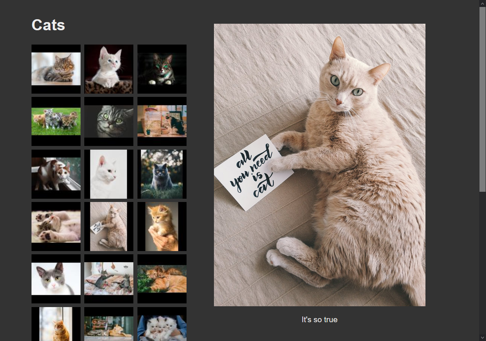

# preen

Media gallery generator. Supports desktop and mobile layouts. No JavaScript.

[](https://choosealicense.com/licenses/unlicense/) [](https://creativecommons.org/publicdomain/zero/1.0/)

## How to use

1. `pip install -r requirements.txt` (optionally, create a virtual environment)
2. Copy `EXAMPLE-CONFIG.toml` to `gallery.toml` in each gallery directory.
3. Copy `EXAMPLE-CONFIG.toml` to `album.toml` in each album directory.
4. Edit the configuration as desired.
5. `python generate-album.py GALLERY_DIRECTORY [GALLERY_DIRECTORY]...`

* Any gallery directories missing `gallery.toml` **will not** be processed.
* Any album directories missing `album.toml` **will not** be processed.
* All settings are **optional**.
* Settings specified in `gallery.toml` will be used as default values if
    unspecified in `album.toml`.
* Captions are pulled from the first specified value in:
    * `Xmp.dc.title`
    * `Xmp.acdsee.caption`
    * `Iptc.Application2.ObjectName`
* Locations are pulled from the first specified value in:
    * `Exif.Image.ImageDescription`
    * `Iptc.Application2.Caption`
    * `Xmp.acdsee.notes`
    * `Xmp.dc.description`
    * `Xmp.exif.UserComment`
    * `Xmp.tiff.ImageDescription`
* If a location is not specified, GPS coordinates are present, and
    `strip_gps_data` is `False`, a DuckDuckGo Maps link will be provided to the
    GPS coordinates.
* For video files: The caption, location, GPS data, and orientation are pulled
    from the XMP sidecar file `FILENAME.xmp`.

### Example input

```
/path/to/media/
    album1/
        album.toml
        image.jpg
        video.mov
        video.mov.xmp
    album2/
        album.toml
        image.png
        video.mp4
        video.mp4.xmp
    gallery.toml
```

### Example output

```
/path/to/media/
    gallery/
        album1/
            thumbnails/
                image.jpg
                video.jpg
            image.jpg
            index.html
            video.mov
        album2/
            thumbnails/
                image.jpg
                video.jpg
            image.png
            index.html
            video.mp4
        index.html
```

## Screenshot


